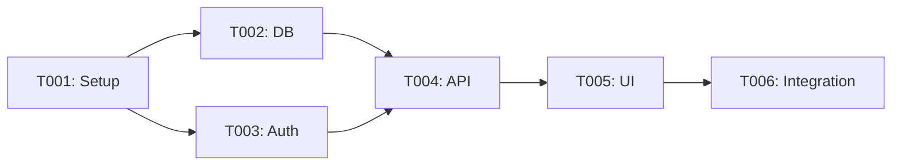

# Tasks: Q{XX} - {Theme}

## Summary

| Metric | Value |
|--------|-------|
| Total Tasks | {N} |
| Phase 1 (Setup) | {N} tasks |
| Phase 2 (Core) | {N} tasks |
| Phase 3 (Integration) | {N} tasks |
| Phase 4 (Polish) | {N} tasks |
| Parallelizable | {N} tasks |

---

## Dependency Graph



---

## Phase 1: Setup

{Foundation tasks that must complete before other work}

### T001: Initialize project structure
[TAGS: Q{XX}, E01, setup, infrastructure]
- **Epic**: E01
- **Story**: N/A (infrastructure)
- **Priority**: Critical
- **Size**: S (4h)
- **Depends**: None
- **Blocks**: T002, T003
- **Parallel**: No
- **Files**:
  - CREATE: `package.json`
  - CREATE: `tsconfig.json`
  - CREATE: `vite.config.ts`
  - CREATE: `.github/workflows/ci.yml`
- **Acceptance**:
  - [ ] Project scaffolded with tech stack
  - [ ] TypeScript configured
  - [ ] Linting configured
  - [ ] CI/CD pipeline running
- **Status**: pending

---

### T002: Set up database schema
[TAGS: Q{XX}, E01, database, backend]
- **Epic**: E01
- **Story**: N/A (infrastructure)
- **Priority**: Critical
- **Size**: M (1d)
- **Depends**: T001
- **Blocks**: T004
- **Parallel**: With T003
- **Files**:
  - CREATE: `prisma/schema.prisma`
  - CREATE: `prisma/migrations/001_initial.sql`
  - CREATE: `prisma/seed.ts`
- **Acceptance**:
  - [ ] Schema matches data contracts
  - [ ] Migration runs successfully
  - [ ] Rollback tested
  - [ ] Seed data available
- **Status**: pending

---

## Phase 2: Core Development

{Main feature implementation}

### T003: Implement authentication API
[TAGS: Q{XX}, E01, US001, auth, backend]
- **Epic**: E01
- **Story**: US001
- **Priority**: High
- **Size**: M (1-2d)
- **Depends**: T002
- **Blocks**: T005
- **Parallel**: With T004
- **Files**:
  - CREATE: `src/api/auth/register.ts`
  - CREATE: `src/api/auth/login.ts`
  - CREATE: `src/api/auth/logout.ts`
  - CREATE: `src/api/auth/__tests__/`
- **Acceptance**:
  - [ ] Register endpoint validates and creates user
  - [ ] Login endpoint returns JWT
  - [ ] Logout invalidates session
  - [ ] Unit tests passing
  - [ ] Integration tests passing
- **Status**: pending

---

### T004: Create core UI components
[TAGS: Q{XX}, E01, frontend, design-system]
- **Epic**: E01
- **Story**: N/A
- **Priority**: High
- **Size**: M (1-2d)
- **Depends**: T001
- **Blocks**: T005
- **Parallel**: With T003
- **Files**:
  - CREATE: `src/design-system/tokens/`
  - CREATE: `src/design-system/primitives/Button.tsx`
  - CREATE: `src/design-system/primitives/Input.tsx`
  - CREATE: `src/design-system/primitives/Card.tsx`
- **Acceptance**:
  - [ ] Design tokens implemented from spec
  - [ ] Button with all variants
  - [ ] Input with validation states
  - [ ] Card component
  - [ ] Storybook stories for all
- **Status**: pending

---

## Phase 3: Integration

{Connecting pieces together}

### T005: Connect auth UI to API
[TAGS: Q{XX}, E01, US001, US002, integration, fullstack]
- **Epic**: E01
- **Story**: US001, US002
- **Priority**: High
- **Size**: M (1d)
- **Depends**: T003, T004
- **Blocks**: T006
- **Parallel**: No
- **Files**:
  - CREATE: `src/features/auth/LoginForm.tsx`
  - CREATE: `src/features/auth/RegisterForm.tsx`
  - CREATE: `src/features/auth/hooks/useAuth.ts`
- **Acceptance**:
  - [ ] Login form submits to API
  - [ ] Register form submits to API
  - [ ] Error states displayed
  - [ ] Loading states shown
  - [ ] Success redirects work
- **Status**: pending

---

## Phase 4: Polish & Testing

{Final testing, cleanup, documentation}

### T006: Write E2E tests
[TAGS: Q{XX}, testing, e2e, quality]
- **Epic**: N/A
- **Story**: All stories
- **Priority**: Medium
- **Size**: M (1d)
- **Depends**: T005
- **Blocks**: None
- **Parallel**: Yes
- **Files**:
  - CREATE: `e2e/auth.spec.ts`
- **Acceptance**:
  - [ ] Register flow E2E test
  - [ ] Login flow E2E test
  - [ ] Error handling tested
  - [ ] Tests run in CI
- **Status**: pending

---

### T007: Documentation and cleanup
[TAGS: Q{XX}, documentation, cleanup]
- **Epic**: N/A
- **Story**: N/A
- **Priority**: Low
- **Size**: S (4h)
- **Depends**: T005
- **Blocks**: None
- **Parallel**: Yes
- **Files**:
  - MODIFY: `README.md`
  - CREATE: `docs/api.md`
- **Acceptance**:
  - [ ] API documentation complete
  - [ ] README updated
  - [ ] No console.logs in code
  - [ ] All TODOs resolved or ticketed
- **Status**: pending

---

## Implementation Schedule

| Week | Tasks | Focus | Checkpoint |
|------|-------|-------|------------|
| 1 | T001, T002 | Setup | Commit: "Setup complete" |
| 2 | T003, T004 | Core | - |
| 3 | T005 | Integration | Commit: "Features working" |
| 4 | T006, T007 | Polish | Commit: "Q{XX} complete" |

---

## Commit Checkpoints

### After Phase 1
```
feat(Q{XX}): complete setup phase

- Initialize project with tech stack
- Set up database schema
- Configure CI/CD

@peachflow: Q{XX}/Phase1/T001-T002
```

### After Phase 3
```
feat(Q{XX}): complete core features

- Implement authentication API
- Create UI components
- Connect frontend to backend

@peachflow: Q{XX}/Phase2-3/T003-T005
```

### After Phase 4
```
feat(Q{XX}): complete quarter

- Add E2E tests
- Update documentation
- Code cleanup

@peachflow: Q{XX}/Phase4/T006-T007
```

---

## Task Status Legend

| Status | Meaning |
|--------|---------|
| pending | Not started |
| in_progress | Currently working |
| blocked | Waiting on dependency |
| review | Complete, awaiting review |
| complete | Done and verified |
